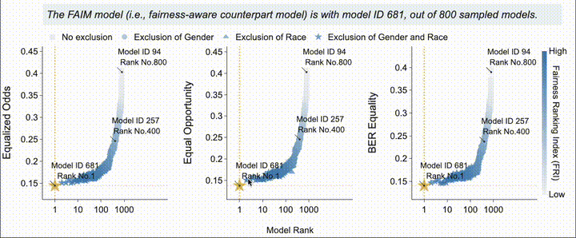
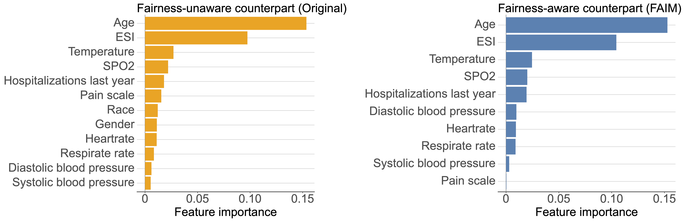

Fairness-Aware Interpretable Modelling (FAIM) for trustworthy machine learning in healthcare
================

<!-- - <a href="#shapleyvic-introduction"
  id="toc-shapleyvic-introduction">ShapleyVIC Introduction</a>
  - <a href="#usage" id="toc-usage">Usage</a>
  - <a href="#installation" id="toc-installation">Installation</a>
    - <a href="#python-library" id="toc-python-library">Python library</a>
    - <a href="#r-package" id="toc-r-package">R package</a>
  - <a href="#citation" id="toc-citation">Citation</a>
    - <a href="#core-paper" id="toc-core-paper">Core paper</a>
    - <a href="#method-extension" id="toc-method-extension">Method
      extension</a>
  - <a href="#contact" id="toc-contact">Contact</a> -->


# FAIM Introduction

As artificial intelligence (AI) plays an increasingly vital role in high-stakes domains like healthcare, concerns about fairness and bias have grown. In healthcare, biased AI models can unfairly impact critical decisions, such as disease diagnosis and organ allocation, leading to health disparities. Achieving fairness and mitigating biases in AI models is challenging and critical in healthcare decision-making.

Existing bias mitigation methods operate at different stages of the modeling process, but many struggle with biases intersecting multiple protected attributes, and some methods compromise model effectiveness. Additionally, interpretability is a challenge, particularly in black-box AI models, making it difficult for clinicians to participate actively in the modeling process.

To address these challenges, we introduce the Fairness-Aware Interpretable Modeling (FAIM) framework. FAIM operates within a cloud of nearly-optimal models, ensuring fairness by leveraging varying degrees of model reliance on specific variables. This framework enhances interpretability and facilitates clinician involvement, achieving contextualized AI fairness in healthcare.

<div class="figure" style="text-align: center">


</div>

## Installation
Execute the following command in Terminal/Command Prompt to install the
Python library from GitHub:

- Linux/macOS:

``` bash
pip install git+"https://github.com/nliulab/FAIM.git"
```

- Windows:

``` bash
python.exe -m pip install git+"https://github.com/nliulab/FAIM.git"
```
## Usage

FAIM consists of 3 general steps:

1.  Nearly-optimal model generation
2. Fairness transmission
3. SHAP-based model explanation
followed by the comparison with other bias-mitigation methods

## Demo: FAIM for prediction hospital admission based on MIMIC-IV-ED data
The dataset can be extracted from [MIMIC-IV-ED benchmark](https://github.com/nliulab/mimic4ed-benchmark). With data splitted into `dat_train`, `dat_test` and `dat_expl` (for fairness tranmission), we can run the following code to generate the nearly-optimal model, transmit fairness, and explain the model.

<details> 
<summary>Initial data processing (starting from MIMIC-IV-ED benchmark)</summary>

```python
esi_dic = {1:"High risk", 2:"High risk", 3:"@Low risk", 4:"@Low risk", 5:"@Low risk"}
dat_train["triage_acuity"] = dat_train["triage_acuity"].map(esi_dic)
dat_expl["triage_acuity"] = dat_expl["triage_acuity"].map(esi_dic)
dat_test["triage_acuity"] = dat_test["triage_acuity"].map(esi_dic)

race_dic = {0:"Asian", 1:"Black", 2:"Hispanic", 3:"Others", 4:"@White"}
dat_train["race"] = dat_train["race"].map(race_dic)
dat_expl["race"] = dat_expl["race"].map(race_dic)
dat_test["race"] = dat_test["race"].map(race_dic)

gender_dic = {0:"Female", 1:"@Male"}
dat_train["gender"] = dat_train["gender"].map(gender_dic)
dat_expl["gender"] = dat_expl["gender"].map(gender_dic)
dat_test["gender"] = dat_test["gender"].map(gender_dic)

var_dict = {"Age": "Age", "gender": "Gender", "race":"Race", "triage_acuity": "ESI", "triage_o2sat": "SPO2", "triage_temperature":"Temperature", "n_hosp_365d":"Hospitalizations last year", "triage_pain": "Pain scale", "triage_heartrate":"Heartrate", "triage_resprate": "Respirate rate", "triage_dbp": "Diastolic blood pressure", "triage_sbp":"Systolic blood pressure"}
```

</details>

Initial setting up:
```python
y_name = 'label'
colnames = ['Age', 'ESI', 'Systolic blood pressure', 'Heartrate', 'Diastolic blood pressure', 'Temperature', 'Pain scale', 'SPO2', 'Respirate rate', 'Hospitalizations last year', 'Gender', 'Race']
x_names_cat = ["ESI", "Gender", "Race"]
sen = ["Gender", "Race"]
sen_ref = {"Gender":"@Male", "Race":"@White"} 

output_dir = "output"
if not os.path.exists(output_dir):
    os.makedirs(output_dir)
```
### Step 1: Nearly-optimal model generation
```python
faim_obj = FAIMGenerator(
  dat_train, 
  selected_vars=colnames, 
  selected_vars_cat=x_names_cat, 
  y_name="label", 
  sen_name=sen, 
  sen_var_ref = sen_ref, 
  criterion="auc", m=800, n_final=200, output_dir=output_dir, without_sen="auto", pre=False)
```

### Step 2: Fairness transmission
```python
faim_obj.FAIM_model(dat_expl)
```

```python
best_results, fair_idx_df = faim_obj.transmit(
  targeted_metrics = ["Equalized Odds", "Equal Opportunity", "BER Equality"]
  ) 
print(best_results['best_sen_exclusion'])
# print(best_results['best_coef'])
```

<p align="center">
   
</p>

"Gender" and "Race" were excluded!

```python
pred_test, fairmetrics_faim, fairsummary_faim = faim_obj.test(dat_test)
```


### Step 3: Shap-based model explanation
```python
shap_compare = faim_obj.compare_explain(overide=True)
shap_compare
```
<div class="figure" style="text-align: center">



</div>

### Comparison with other bias-mitigation methods
```python
fairbase = FairBase(
  dat_train, 
  selected_vars=colnames, 
  selected_vars_cat=x_names_cat, 
  y_name="label", 
  sen_name=sen, 
  sen_var_ref=sen_ref, 
  weighted=True, 
  weights={"tnr": 0.5, "tpr": 0.5}
  )
```
- Original LR
```python
lr_results = fairbase.model(method="OriginalLR")
pred_ori, fairmetrics_ori, clametrics_ori = fairbase.test(dat_test, model=lr_results)
fairmetrics_ori
```
- Reweigh
```python
_, rw_results, _ = fairbase.model(method_type="pre", method="Reweigh")
pred_rw, fairmetrics_rw, clametrics_rw = fairbase.test(dat_test, model=rw_results)
fairmetrics_rw
```

summary of results:
```python
faircompare_df = pd.concat([fairmetrics_ori, fairmetrics_faim, fairmetrics_rw])
```
| Metric              | Equal Opportunity | Equalized Odds | Statistical Parity | Accuracy Equality | BER Equality | 
|---------------------|-------------------|----------------|--------------------|-------------------|----------|
| Original LR                   | 0.316338          | 0.316338       | 0.39563            | 0.049166          | 0.301258 |
| Reweigh                   | 0.206211          | 0.206211       | 0.207493           | 0.047577          | 0.18257  | 
| FAIM                    | 0.133691          | 0.146606       | 0.241103           | 0.04704           | 0.140149 |

```python
clacompare_df = pd.concat([clametrics_ori, clametrics_faim, clametrics_rw])
```

|           | auc_low   | auc       | auc_high  |
|-----------|----------|----------|-----------|
| Original  | 0.787 | 0.790 | 0.793  |
| Reweigh   | 0.786 | 0.792 | 0.792  |
| FAIM      | 0.783 | 0.786 | 0.789  |


## Citation
- Liu, M., Ning, Y., Ke, Y., Shang, Y., Chakraborty, B., Ong, M. E. H., Vaughan, R. & Liu, N. (2024). [Fairness-Aware Interpretable Modeling (FAIM) for Trustworthy Machine Learning in Healthcare.](https://arxiv.org/abs/2403.05235) arXiv preprint arXiv:2403.05235.
## Contact

- Mingxuan Liu (Email: <mingxuan.liu@u.duke.nus.edu>)
- Nan Liu (Email: <liu.nan@duke-nus.edu.sg>)